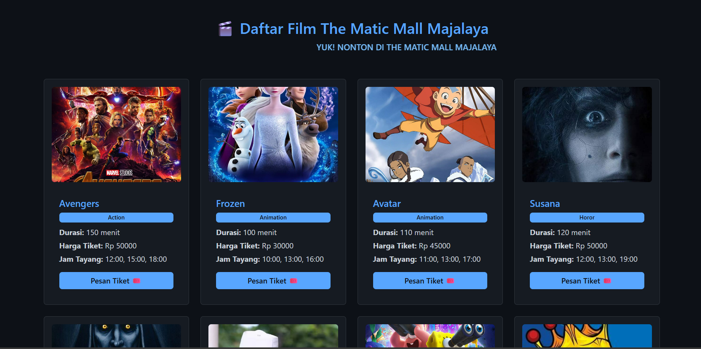
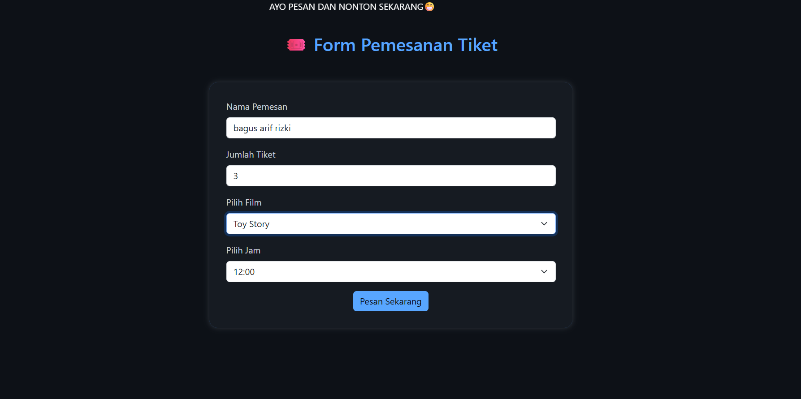
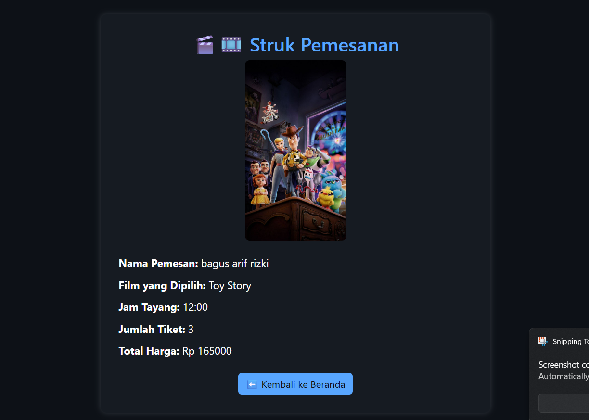

🎬 Aplikasi Pemesanan Tiket Bioskop (JSP)
📌 Deskripsi Project
Aplikasi ini merupakan proyek UTS berbasis JSP (Java Server Pages) yang memungkinkan pengguna untuk melakukan pemesanan tiket bioskop secara online.

Fitur utama:

Menampilkan daftar film dan jam tayang dari ArrayList

Form pemesanan tiket (input: nama, jumlah tiket, film, jam)

Menampilkan struk transaksi pemesanan (nama, film, jam tayang, jumlah tiket, total harga)

Tampilan responsif dan elegan dengan Bootstrap dan animasi modern

🧾 Fitur Output yang Ditampilkan
Nama Pemesan

Film yang Dipilih

Jam Tayang

Jumlah Tiket

Total Harga (format rupiah)

🖼 Screenshot Output
1. 

2. 

3. 

▶️ Cara Menjalankan Aplikasi
1. Git Clone Project ini
2. Aktifkan Xampp Apache dan Tomcat
3. Buka Project
4. Jalankan file index.jsp
5. Enjoy and tetap ngopi.
